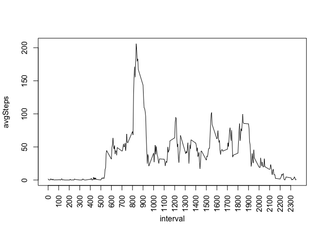

# Reproducible Research: Peer Assessment 1
José Incera  
Apr 2015  

## Introduction
This report answers the requirements of Assesment 1 of the course Reproducible Research.
The detailed requirements can be found in the Readme.md file.

The report is divided in the sections already defined in the template

## Loading and preprocessing the data

We start by reading the data from the activity.csv file and checking how many days are included

**We assume that the file has already been unzipped and is in the working directory**


```r
rawData<-read.csv("activity.csv")
nlevels(rawData$date)
```

```
## [1] 61
```

## What is mean total number of steps taken per day?

To summarise the raw data by date and compute the total sum per day,  we will use the dplyr package.
Observe that we may ignore the missing values for this section


```r
library(dplyr)
```

```
## 
## Attaching package: 'dplyr'
## 
## The following object is masked from 'package:stats':
## 
##     filter
## 
## The following objects are masked from 'package:base':
## 
##     intersect, setdiff, setequal, union
```

```r
tmp<-group_by(rawData,date)
sumPerDay <- summarise(tmp,totSteps=sum(steps,na.rm=T))
```

Let us see the histogram


```r
hist(sumPerDay$totSteps,breaks=10,col="lightgreen",main="TotalSteps")
```

 

... and the mean and median of the total number of steps per day (that is, the mean and median of the data used for the histogram, not the mean and median for the data corresponding to each day)


```r
avgTotSteps = mean(sumPerDay$totSteps)

medianTotSteps = median(sumPerDay$totSteps)
```

The results are consistent: the highest bar, which corresponds to the median, is above the 10,000 value

## What is the average daily activity pattern?

* *Make a time series plot (i.e. type = "l") of the 5-minute interval (x-axis) and the average number of steps taken, averaged across all days (y-axis)*

* *Which 5-minute interval, on average across all the days in the dataset, contains the maximum number of steps?*

Now we summarise per interval and compute the average over the intervals


```r
tmp=group_by(rawData,interval)
meanPerInterval<-summarise(tmp,avgSteps=mean(steps,na.rm=T))
```

Let us plot this average and find out which interval has the maximum number of steps


```r
plot(meanPerInterval,type="l",las=2)
```

 

```r
meanPerInterval[meanPerInterval$avgSteps == max(meanPerInterval$avgSteps),1]
```

```
## Source: local data frame [1 x 1]
## 
##   interval
## 1      835
```

It looks Ok: the peak is between intervals 500 and 1000; our computations says it is interval 835

## Imputing missing values

In this segment we want to see if/how our statistics would change if we replace the missing data with some other (reasonable) value.

  * *Calculate and report the total number of missing values in the dataset (i.e. the total number of rows with NAs)*
  
  

    Devise a strategy for filling in all of the missing values in the dataset. The strategy does not need to be sophisticated. For example, you could use the mean/median for that day, or the mean for that 5-minute interval, etc.

    Create a new dataset that is equal to the original dataset but with the missing data filled in.

    Make a histogram of the total number of steps taken each day and Calculate and report the mean and median total number of steps taken per day. Do these values differ from the estimates from the first part of the assignment? What is the impact of imputing missing data on the estimates of the total daily number of steps?

## Are there differences in activity patterns between weekdays and weekends?

For this part the weekdays() function may be of some help here. Use the dataset with the filled-in missing values for this part.

    Create a new factor variable in the dataset with two levels -- "weekday" and "weekend" indicating whether a given date is a weekday or weekend day.

    Make a panel plot containing a time series plot (i.e. type = "l") of the 5-minute interval (x-axis) and the average number of steps taken, averaged across all weekday days or weekend days (y-axis). The plot should look something like the following, which was created using simulated data:
