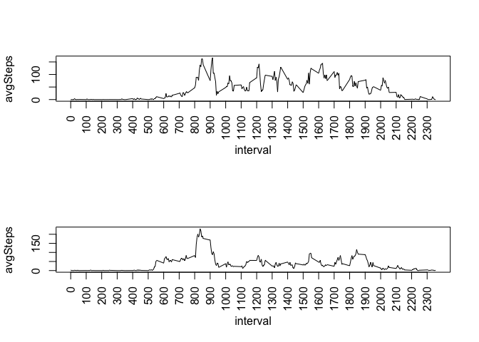

# Reproducible Research: Peer Assessment 1
José Incera  
Apr 2015  

## Introduction
This report answers the requirements of Assesment 1 of the course Reproducible Research.
The detailed requirements can be found in the Readme.md file.

The report is divided in the sections already defined in the template

## Loading and preprocessing the data

We start by reading the data from the activity.csv file and checking how many days are included

**We assume that the file has already been unzipped and is in the working directory**


```r
rawData<-read.csv("activity.csv")
nlevels(rawData$date)
```

```
## [1] 61
```

## What is mean total number of steps taken per day?

To summarise the raw data by date and compute the total sum per day,  we will use the dplyr package.

Observe that we may ignore the missing values for this section


```r
library(dplyr)
```

```
## 
## Attaching package: 'dplyr'
## 
## The following object is masked from 'package:stats':
## 
##     filter
## 
## The following objects are masked from 'package:base':
## 
##     intersect, setdiff, setequal, union
```

```r
tmp<-group_by(rawData,date)
sumPerDay <- summarise(tmp,totSteps=sum(steps,na.rm=T))
```

Let us see the histogram


```r
hist(sumPerDay$totSteps,breaks=10,col="lightgreen",main="TotalSteps")
```

 

... and the mean and median of the total number of steps per day (that is, the mean and median of the data used for the histogram, not the mean and median for the data corresponding to each day)


```r
avgTotSteps = mean(sumPerDay$totSteps)

medianTotSteps = median(sumPerDay$totSteps)

sprintf("Mean total steps: %f; median: %f",avgTotSteps,medianTotSteps)
```

```
## [1] "Mean total steps: 9354.229508; median: 10395.000000"
```


## What is the average daily activity pattern?

In order to answer this question, we summarise per interval and compute the average over the intervals


```r
tmp=group_by(rawData,interval)
meanPerInterval<-summarise(tmp,avgSteps=mean(steps,na.rm=T))
```

Let us plot this average and find out which interval has the maximum number of steps


```r
plot(meanPerInterval, type="l",xaxt='n')
axis(1,at=seq(0,2355,by=100),las=2)
```

 

```r
meanPerInterval[meanPerInterval$avgSteps == max(meanPerInterval$avgSteps),1]
```

```
## Source: local data frame [1 x 1]
## 
##   interval
## 1      835
```

It looks Ok: the peak is between intervals 500 and 1000; our computations says it is interval 835, that is, 8:35, which is actually the 104th lecture (we used the View command, not shown in the report)

## Imputing missing values

In this segment we want to see if/how our statistics would change if we replace the missing data with some other (reasonable) value.

Since we have already computed the average of the 5-minute intervals, it seems it is a good fit for the missing values.

Let us start by computing the missing values in the dataset. 


```r
  missingValues<-which(is.na(rawData))
  mv <- length(missingValues)
  sprintf("The total missing values is> %d",mv)
```

```
## [1] "The total missing values is> 2304"
```

We will create a new dataset with the missing data replaced by the average previously computed in the meanPerInterval table

We start by converting that table to a data frame and then we loop throught the whole number or rows looking for missing steps that have to be substituted


```r
mi <-as.data.frame(meanPerInterval) # Convert table to data frame

rd = rawData #New data set
for ( i in 1: nrow(rd)){
  if(is.na(rd[i,1]))
    rd[i,1]<- mi[mi$interval==rd[i,3],2]
  }
```

Now let us see the histogram, mean and median of the new data set.


```r
tmp2<-group_by(rd,date)
spd <- summarise(tmp2,totSteps=sum(steps,na.rm=T))

hist(spd$totSteps,breaks=10,col="lightgreen",main="TotalSteps")
```

 

```r
avts = mean(spd$totSteps)

medts = median(spd$totSteps)

sprintf("With imputed data, mean total steps: %f; median: %f",avts,medts)
```

```
## [1] "With imputed data, mean total steps: 10766.188679; median: 10766.188679"
```

It has certainly changed!  We have a histogram that look more symmetric.  The most important observation is that the mean and median are much closer now

## Are there differences in activity patterns between weekdays and weekends?

We create a new column dayOfWeek and another typeOfDay where weekend is "Saturday" and "Sunday" and weekday are all the others


```r
weekdays(as.Date(rd$date))->rd$dayOfWeek
weekendDays<-c('Saturday','Sunday')
rd$typeOfDay<-factor((rd$dayOfWeek %in% weekendDays)+1L,levels=1:2,labels=c('weekday','weekend'))
```

Let us plot the average number of steps with 5-minute intervals of weekdays vs weekends to see if there are some differences 


```r
t1<-group_by(rd[rd$typeOfDay=='weekend',],interval)
t2<-group_by(rd[rd$typeOfDay=='weekday',],interval)
meanwd<-summarise(t1,avgSteps=mean(steps))
meanwe<-summarise(t2,avgSteps=mean(steps))
    
par(mfrow=c(2,1))
plot(meanwd, type="l",xaxt='n')
axis(1,at=seq(0,2355,by=100),las=2)
plot(meanwe, type="l",xaxt='n')
axis(1,at=seq(0,2355,by=100),las=2)
```

 

